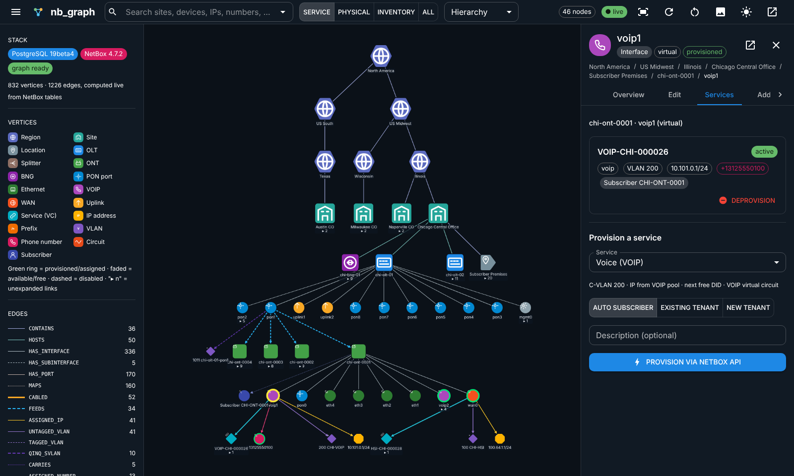
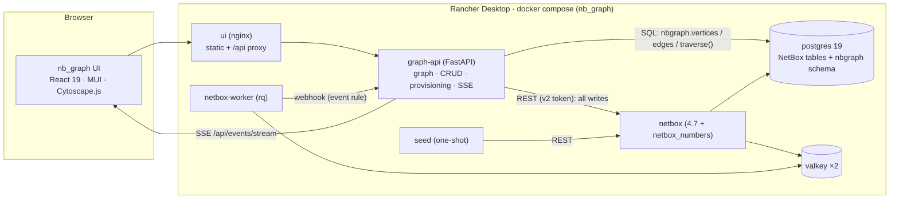

# nb_graph

**A graph-first UI for NetBox.** nb_graph projects NetBox's PostgreSQL 19 database into a live property graph
(vertices and edges) and puts an interactive React + Cytoscape explorer on top. You can walk the network from
**Region → Site → OLT → PON → ONT → interface → IP / VLAN / phone number / service**, and every create, edit,
delete and provisioning action is sent back through the **NetBox REST API**.

It ships as one self-contained demo stack (`docker compose`) built for **Rancher Desktop**.



## Highlights

| | |
|---|---|
| **Live graph in PostgreSQL 19** | The `nbgraph` schema computes vertices and edges from NetBox's own tables on every query. Nothing is copied, and NetBox and the graph can never drift apart. Breadth-first traversal and shortest-path functions run in SQL. |
| **SQL/PGQ-ready** | The vertex/edge model matches ISO SQL/PGQ. `db/graph/090_pgq_future.sql` is a `CREATE PROPERTY GRAPH` definition that was checked on PG19beta3. SQL/PGQ was then pulled from PG19 GA, so this file waits for PG20 ([why](docs/pg19-graph.md)). |
| **Graph UI** | Double-click to expand or collapse. Right-click for actions. Switch lenses (Service / Physical / Inventory / All) and layouts (hierarchy, organic, tree, concentric), and search across every object. Includes a path-to-root breadcrumb, a cable trace through splitters and circuits, and PNG export. |
| **CRUD from the graph** | Create, edit and delete forms are built from NetBox's OPTIONS metadata, and NetBox does all the validation. You can add children in context: a site under a region, an OLT under a site, an ONT under a PON port, an IP under an interface. |
| **Service provisioning** | Click an ONT `wan0`, `voip1` or `eth1` → **Provision**. One click runs tenant → C-VLAN (Q-in-Q) → IP → DID → virtual circuit. If any step fails, the earlier steps are rolled back automatically. |
| **Bulk provisioning** | Right-click a region, site, OLT, PON port or ONT → dry-run plan of every free eligible port → a background job provisions them one saga at a time (each port rolls back on its own) with live progress. |
| **Number inventory** | IP prefixes and addresses, VLAN groups and VLANs (S-VLAN/C-VLAN), and telephone numbers (DIDs, through the bundled `netbox_numbers` plugin), all as graph nodes. |
| **Map view** | Sites placed by NetBox latitude/longitude on an OpenStreetMap base, sized by device count and joined by their site-to-site circuits. Drag or place a site to write its position back to NetBox. Click through to the graph. |
| **Live updates** | A NetBox event rule sends webhooks to graph-api, which pushes them to the UI over SSE. Edits made in NetBox's own UI show up on open graphs within a second. |

## Quick start (Rancher Desktop)

```bash
git clone https://github.com/rogerwtrimble-tech/nb_graph.git
cd nb_graph
cp .env.example .env                 # or: make env   (random secrets)
docker compose up -d --build         # first start ≈ 5–10 min (NetBox runs ~800 migrations on PG19)
docker compose logs -f seed          # wait for "seed complete"
```

| URL | What | Login |
|---|---|---|
| http://localhost:8080 | **nb_graph UI** | – |
| http://localhost:8000 | NetBox 4.7 | `admin` / `admin` (from `.env`) |
| http://localhost:8090/docs | graph-api OpenAPI (Swagger) | – |
| `localhost:5432` | PostgreSQL 19 (`netbox`/`$DB_PASSWORD`) | `make psql` |

Rancher Desktop must use the **dockerd (moby)** container engine. The step-by-step setup is in
**[docs/docker-setup.md](docs/docker-setup.md)**.

## Architecture



Reads go through SQL (fast traversal over the live projection). Writes go through the NetBox API, so NetBox's
validation, permissions, change log and webhooks all still apply. See [docs/architecture.md](docs/architecture.md).

## Repository layout

```
nb_graph/
├── docker-compose.yml        # the whole demo stack
├── .env.example              # ports, image tags, demo secrets
├── Makefile                  # up / down / reset / seed / psql / test ...
├── db/
│   ├── initdb/               # first-boot SQL (ltree, pg_trgm)
│   └── graph/                # nbgraph schema: 010 schema, 020 vertices, 030 edges, 040 traversal, 090 PGQ (future)
├── graph-api/                # FastAPI: graph read API, CRUD proxy, provisioning saga, SSE, demo seeder, tests
├── netbox/                   # NetBox image (official + plugin), configuration (from netbox-docker), env
├── plugins/netbox_numbers/   # NetBox 4.7 plugin: telephone-number (DID) inventory
├── ui/                       # React + Vite + MUI + Cytoscape UI, nginx config
├── scripts/gen-env.py        # random-secret .env generator
└── docs/                     # guides, diagrams, screenshots
```

## Documentation

| Doc | Contents |
|---|---|
| [docs/setup-guide.md](docs/setup-guide.md) | Prerequisites, first run, verification checklist, day-2 operations, troubleshooting |
| [docs/docker-setup.md](docs/docker-setup.md) | Rancher Desktop configuration, step-by-step compose process, every container, volumes, ports, upgrades |
| [docs/architecture.md](docs/architecture.md) | Components, data flow, sequence diagrams, design decisions |
| [docs/graph-model.md](docs/graph-model.md) | Vertex kinds, edge labels, lenses, SQL functions, example queries |
| [docs/pg19-graph.md](docs/pg19-graph.md) | PostgreSQL 19 vs SQL/PGQ status, NetBox on PG19, the PGQ definition and its verified output |
| [docs/provisioning.md](docs/provisioning.md) | FTTH demo model, service catalogue, provisioning saga and rollback |
| [docs/ui-guide.md](docs/ui-guide.md) | Using the explorer: gestures, lenses, inspector, CRUD, live updates |
| [docs/api.md](docs/api.md) | graph-api REST reference with curl examples |
| [docs/nb_graph-status.md](docs/nb_graph-status.md) | Build status, agreed decisions and next ideas |

## Built from open source

[NetBox](https://github.com/netbox-community/netbox) 4.7 ·
[netbox-docker](https://github.com/netbox-community/netbox-docker) (image and configuration) ·
[PostgreSQL](https://www.postgresql.org/) 19 · [Valkey](https://valkey.io/) ·
[FastAPI](https://fastapi.tiangolo.com/) · [psycopg 3](https://www.psycopg.org/) · [httpx](https://www.python-httpx.org/) ·
[React](https://react.dev/) · [Vite](https://vite.dev/) · [MUI](https://mui.com/) · [Cytoscape.js](https://js.cytoscape.org/)
(+ [dagre](https://github.com/cytoscape/cytoscape.js-dagre), [fCoSE](https://github.com/iVis-at-Bilkent/cytoscape.js-fcose)) ·
[TanStack Query](https://tanstack.com/query) · [notistack](https://notistack.com/) · nginx.

## Status and caveats

* **Demo / MVP.** It uses one superuser API token on the server side, default secrets and no TLS. Read
  [Hardening](docs/setup-guide.md#hardening-before-anything-beyond-a-demo) before exposing it anywhere.
* **PostgreSQL 19 is a beta** (19beta4, released 2026-09-24; GA is planned for October 2026). NetBox 4.7 officially
  supports PG 15+ and does not yet list PG19. nb_graph runs it on PG19 anyway: all ~800 migrations and the full
  test suite pass on 19beta4.
* The demo data is fictional (Acme Optical, Metro Fiber Co, 555 numbers).

License: Apache-2.0 (see [LICENSE](LICENSE)). `netbox/configuration/*.py` comes from netbox-docker (Apache-2.0).
