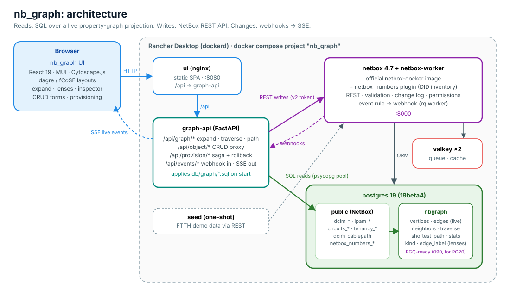
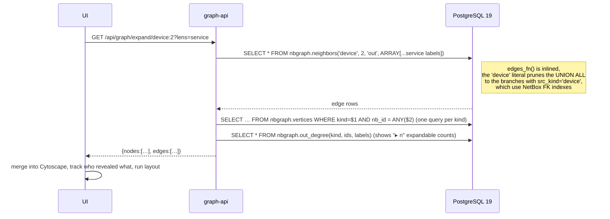
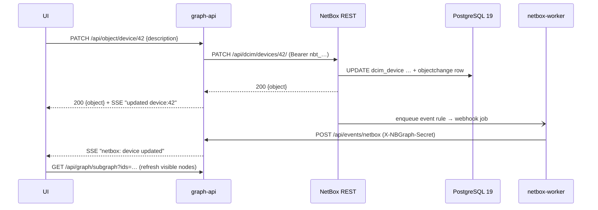
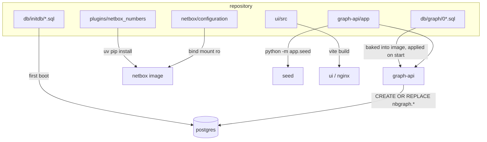

# Architecture

## Components

| Component | Tech | Responsibility |
|---|---|---|
| **postgres** | PostgreSQL 19 (official image) | NetBox's relational schema **and** the `nbgraph` schema: a live property-graph projection plus traversal functions |
| **netbox / netbox-worker** | NetBox 4.7 (netbox-docker image) + `netbox_numbers` plugin | Source of truth: validation, permissions, change log, REST/GraphQL API, event rules → webhooks |
| **graph-api** | Python 3.13, FastAPI, psycopg 3 pool, httpx | 1) graph reads in SQL, 2) CRUD proxy to the NetBox REST API, 3) provisioning sagas, 4) SSE fan-out of change events, 5) applies the graph schema on boot |
| **ui** | React 19, MUI 9, Cytoscape.js (+dagre, fCoSE), TanStack Query, nginx | Graph explorer, inspector, schema-driven forms, provisioning panel, live updates |
| **seed** | same image as graph-api | Idempotent FTTH demo data (uses the same provisioning code as the UI) |

## Read path: graph queries in SQL

On the demo data (≈830 vertices / 1,220 edges), a single expand takes ~20 ms, a 4-level traversal ~50 ms and a
shortest path ~150 ms on a laptop.

## Write path: always through NetBox

Because the graph is a live projection, the next read after the write already reflects it. There is no sync job
to wait for.

## Provisioning saga

See [provisioning.md](provisioning.md) for the full sequence. In short: every step is a NetBox REST call, each
created object is pushed onto an undo stack, and any failure rolls back in reverse order.

## Design decisions

| # | Decision | Why | Alternatives considered |
|---|---|---|---|
| D1 | **Graph = live SQL projection over NetBox tables**, no copied data | Zero drift, nothing to sync, works on any PG ≥ 15 | Sync NetBox into Neo4j / Apache AGE (AGE doesn't support PG19 yet; adds a second store and a sync job) |
| D2 | Projection functions are **string-bodied `LANGUAGE sql`**, wrapped by views | PostgreSQL inlines them, so filters still reach the base tables. Unlike plain views they register no `pg_depend` rows, so NetBox migrations that alter columns never fail because of nb_graph. | Plain views (would block `ALTER COLUMN`/`DROP COLUMN` in NetBox upgrades), materialized views (stale between refreshes) |
| D3 | Traversal in **PL/pgSQL BFS** (`traverse`, `shortest_path`) | SQL/PGQ was pulled from PG19, and even its beta only supported fixed-length MATCH patterns ([proof](pg19-graph.md#verified-on-pg19beta3)). BFS gives variable depth, a visited set and limits. | Recursive CTEs (exponential on cyclic graphs without a visited set), app-side BFS (N round trips) |
| D4 | Keep a **PGQ-ready** schema (`090_pgq_future.sql`) | Same labels and keys, so moving fixed-depth queries to `GRAPH_TABLE` on PG20 is a drop-in change | – |
| D5 | **All writes via NetBox REST** with a server-side v2 token | NetBox keeps validation, permissions, change log and webhooks. The browser never holds a token. | Writing SQL directly (bypasses all NetBox semantics, so it was rejected) |
| D6 | **Provisioning as a saga with compensation** | NetBox has no multi-object transaction over REST. Compensation keeps the data consistent. | NetBox custom script (works, but ties the UI to script jobs. A possible extension.) |
| D7 | **Derived `FEEDS` edge from `dcim_cablepath`** | NetBox already traces ONT → splitter front/rear ports → OLT PON. Reusing its trace gives a correct OLT→ONT relationship for free. | Custom FK or custom field on ONT (duplicates topology) |
| D8 | **Own `netbox_numbers` plugin** | The existing phone-number plugins (`netbox-phonebox`, `phonebox_plugin`) support NetBox ≤ 4.4 only | Custom fields (no inventory or status semantics) |
| D9 | **Lenses** (service / physical / inventory / all) defined in SQL (`nbgraph.edge_label.lens`) | One graph, several readable views. New edge labels show up in the UI automatically. | Separate UIs per domain |
| D10 | **Cytoscape.js** with dagre + fCoSE | Mature MIT-licensed graph renderer with compound layouts and good performance at thousands of elements | React Flow (better for node-editor UIs than large network graphs), vis-network, Sigma.js (WebGL, fewer layout options) |
| D11 | **SSE** for live updates | One-way, proxies cleanly through nginx, auto-reconnects | WebSockets (two-way, not needed) |

## Repository → runtime mapping

