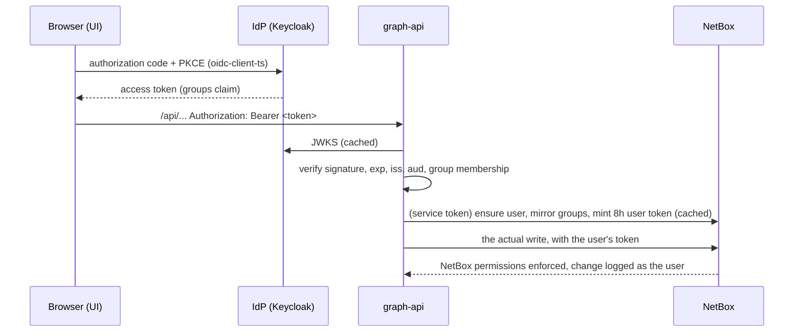

# Per-user authentication (OIDC)

By default (`AUTH_MODE=none`) nb_graph is an open demo: anyone who can reach the UI can use it, and every
NetBox write is made with the single superuser token from `.env`.

With `AUTH_MODE=oidc`, users sign in through an OpenID Connect provider and **every NetBox write is made as
that user**. NetBox's own object permissions decide what they may change, and NetBox's change log (and the
live-update toasts) name the real person.

## Try it with the bundled Keycloak

```bash
# .env
AUTH_MODE=oidc

docker compose --profile auth up -d     # adds Keycloak on http://localhost:8180
docker compose run --rm seed            # (once, on an existing stack) creates the NetBox role groups
```

Open http://localhost:8080. You are sent to Keycloak to sign in:

| User / password | IdP group | In nb_graph |
|---|---|---|
| `alice` / `alice` | `nbgraph-editors` | read everything, create / edit / delete / provision |
| `bob` / `bob` | `nbgraph-viewers` | read everything. NetBox refuses writes (403), and the UI shows "read-only" |
| `carol` / `carol` | none | refused with 403 (not in an nb_graph group) |

Keycloak admin console: http://localhost:8180 (`admin` / `KEYCLOAK_ADMIN_PASSWORD`). The realm comes from
`auth/realm-nbgraph.json`. The demo realm allows the password grant so tests can get tokens. Turn that off
(`directAccessGrantsEnabled`) for real use.

## How it works



* **Reads** (the graph, map and search) are SQL over NetBox's tables. They need a valid token and membership
  of one of `OIDC_GROUPS`, and are not filtered further by NetBox permissions.
* **Writes** (CRUD, provisioning, bulk jobs, map repositioning) go to NetBox with a per-user API token.
  graph-api creates the NetBox user on first sign-in and syncs its group membership on every token mint:
  IdP groups listed in `OIDC_GROUPS` map to NetBox groups of the same name. The seed creates
  `nbgraph-editors` (view/add/change/delete on dcim, ipam, circuits, tenancy and numbers objects) and
  `nbgraph-viewers` (view). Edit those NetBox permissions to tighten things further, for example per site
  or tenant with NetBox permission constraints.
* Per-user NetBox tokens are labelled `nb_graph session (minted by graph-api)`, expire after
  `USER_TOKEN_TTL_MINUTES` (default 480), and are replaced on renewal. The user's own NetBox tokens are never
  touched.
* The SSE stream takes the token as `?access_token=`, because `EventSource` can't send headers. The UI
  reconnects whenever the token is renewed.
* Public without a token: `/api/health` (which tells the UI how to sign in) and `/api/events/netbox` (the
  NetBox webhook, protected by `WEBHOOK_SECRET`).

## Settings (graph-api environment)

| Variable | Default | Meaning |
|---|---|---|
| `AUTH_MODE` | `none` | `oidc` turns all of this on |
| `OIDC_ISSUER` | `http://localhost:8180/realms/nbgraph` | must equal the token's `iss`: the issuer URL the **browser** uses |
| `OIDC_INTERNAL_URL` | `http://keycloak:8080/realms/nbgraph` | the same issuer as reached from the graph-api container (used for discovery and JWKS) |
| `OIDC_CLIENT_ID` | `nb-graph` | public client used by the UI (PKCE, no secret) |
| `OIDC_AUDIENCE` | client id | expected `aud` |
| `OIDC_GROUPS_CLAIM` | `groups` | claim holding group names (a leading `/` is stripped) |
| `OIDC_GROUPS` | `nbgraph-editors,nbgraph-viewers` | allowed groups, mirrored to NetBox groups |
| `USER_TOKEN_TTL_MINUTES` | `480` | lifetime of minted NetBox user tokens |

The service token (`NETBOX_TOKEN`) must be allowed to manage users and grant tokens. The demo superuser is.

## Using another IdP (Entra ID, Okta, Authentik, ...)

1. Register a **public SPA client** with redirect URI `http://<ui-host>/` (and `/*` if your IdP needs it), PKCE S256.
2. Put a `groups` claim (group *names*) in the **access token**, and make sure `aud` contains the client id
   (or set `OIDC_AUDIENCE`).
3. Set `OIDC_ISSUER` (and `OIDC_INTERNAL_URL` only if graph-api reaches the IdP at a different URL), then
   create NetBox groups named after the IdP groups you list in `OIDC_GROUPS`.

## Not covered yet

* Signing in to **NetBox's own UI** with the same IdP. NetBox supports it (`SOCIAL_AUTH_OIDC_*` in
  `netbox/configuration/configuration.py`), but it isn't wired up in compose. Users created by graph-api get
  a random password and are meant to sign in through SSO.
* Read filtering by NetBox permissions on the SQL graph.
