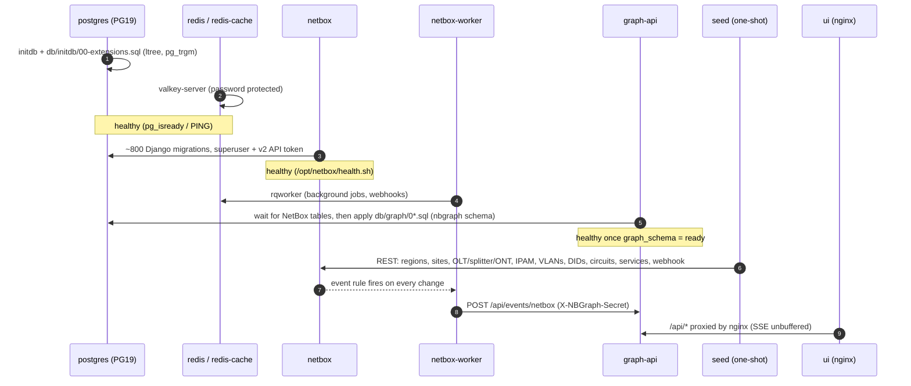

# Docker setup: running nb_graph on Rancher Desktop

nb_graph runs as one Docker Compose project called `nb_graph`, with seven long-running containers and one
one-shot container. This page covers every step, from a fresh Rancher Desktop install to a running demo.

- [1. Configure Rancher Desktop](#1-configure-rancher-desktop)
- [2. Get the code and the environment file](#2-get-the-code-and-the-environment-file)
- [3. Build and start](#3-build-and-start)
- [4. What starts, in which order](#4-what-starts-in-which-order)
- [5. Verify](#5-verify)
- [6. Containers, ports and volumes](#6-containers-ports-and-volumes)
- [7. Everyday commands](#7-everyday-commands)
- [8. Switching PostgreSQL 19 beta → GA, and other upgrades](#8-switching-postgresql-19-beta--ga-and-other-upgrades)
- [9. Rancher Desktop troubleshooting](#9-rancher-desktop-troubleshooting)

---

## 1. Configure Rancher Desktop

| Setting | Where | Value |
|---|---|---|
| Container engine | *Preferences → Container Engine* | **dockerd (moby)**. The stack uses the `docker compose` CLI. |
| Kubernetes | *Preferences → Kubernetes* | Optional. **Disable** it to free about 1 GB of RAM (nb_graph doesn't use it). |
| Memory | *Preferences → Virtual Machine → Hardware* (macOS/Linux) or `.wslconfig` (Windows) | **≥ 6 GB** (8 GB recommended) |
| CPUs | same | **≥ 4** |
| Disk | – | about 6 GB free for images and volumes |
| WSL integration (Windows) | *Preferences → WSL → Integrations* | Turn it on for the distro you'll run commands from (optional; PowerShell works too) |

Then check from a terminal:

```bash
docker version            # Server: Docker Engine (moby) must be listed
docker compose version    # Docker Compose v2.x or later
docker info --format '{{.MemTotal}}'   # should be > 6000000000
```

> **containerd / nerdctl?** `nerdctl compose up -d --build` mostly works too, but the docs and the
> Makefile assume dockerd. If you stay on containerd, use `nerdctl` everywhere you see `docker` below.

## 2. Get the code and the environment file

```bash
git clone https://github.com/rogerwtrimble-tech/nb_graph.git
cd nb_graph

# EITHER keep the demo defaults (admin/admin, fixed demo token):
cp .env.example .env              # PowerShell:  Copy-Item .env.example .env

# OR generate random secrets (prints the new admin password):
python3 scripts/gen-env.py        # same as: make env
```

What `.env` controls:

| Variable | Default | Purpose |
|---|---|---|
| `POSTGRES_IMAGE_TAG` | `19beta4-alpine` | Official `postgres` image tag. Change to `19-alpine` once GA ships (see §8). |
| `NETBOX_IMAGE` | `docker.io/netboxcommunity/netbox:v4.7-5.1.1` | Base image for `netbox/Dockerfile` |
| `UI_PORT` / `NETBOX_PORT` / `GRAPH_API_PORT` / `PG_PORT` | 8080 / 8000 / 8090 / 5432 | Host ports. The API and PG are bound to 127.0.0.1 only. |
| `DB_PASSWORD`, `REDIS_PASSWORD`, `REDIS_CACHE_PASSWORD` | demo values | Backing-service credentials |
| `SECRET_KEY`, `API_TOKEN_PEPPER_1` | demo values | NetBox secrets (the pepper is required for v2 API tokens) |
| `SUPERUSER_NAME` / `SUPERUSER_PASSWORD` | admin / admin | NetBox web login |
| `SUPERUSER_API_KEY` / `SUPERUSER_API_TOKEN` | 12 / 40 alphanumeric chars | Together they form the v2 token `nbt_<key>.<token>` that graph-api and seed use |
| `WEBHOOK_SECRET` | demo value | Shared secret on NetBox → graph-api webhooks |
| `SEED_DEMO_DATA` | `true` | `false` starts an empty NetBox (the graph fills in as you add data) |

## 3. Build and start

```bash
docker compose up -d --build
```

This builds three local images and pulls the rest:

| Image | Built from | Notes |
|---|---|---|
| `nb_graph/netbox:4.7-local` | `netbox/Dockerfile` | official NetBox image + `plugins/netbox_numbers` + `collectstatic` |
| `nb_graph/graph-api:0.1` | `graph-api/Dockerfile` | Python 3.13 slim + FastAPI. Also contains `db/graph/*.sql` and runs the `seed` service. |
| `nb_graph/ui:0.1` | `ui/Dockerfile` | multi-stage: `node:22-alpine` builds the UI, `nginx:1.29-alpine` serves it |
| `postgres:19beta4-alpine`, `valkey/valkey:9.1-alpine` | Docker Hub | pulled |

Watch it come up:

```bash
docker compose ps                     # health column
docker compose logs -f netbox         # "Applying database migrations" … "✅ Initialisation is done."
docker compose logs -f graph-api      # "graph schema installed: 010_schema.sql, 020_..., 040_..."
docker compose logs -f seed           # "site Chicago Central Office" … "seed complete in …s"
```

First start takes about **5–10 minutes**: NetBox applies ~800 migrations to the empty PG19 database. Later
starts take seconds.

## 4. What starts, in which order

Compose enforces this order through `depends_on` + health checks:



## 5. Verify

```bash
curl -s localhost:8090/api/health
# {"graph_schema":"ready","netbox_public_url":"http://localhost:8000","postgres":"19beta4","netbox":"4.7.x"}

curl -s localhost:8090/api/graph/stats          # vertex/edge counts per kind/label
docker compose exec postgres psql -U netbox -d netbox -c "SELECT * FROM nbgraph.stats ORDER BY 1,2;"
```

Then open http://localhost:8080. You should see the region tree (North America → US Midwest/US South → states → 4
central offices). Double-click **Chicago Central Office**. The full checklist is in
[setup-guide.md](setup-guide.md#verification-checklist).

## 6. Containers, ports and volumes

| Service | Image | Host port | Health check | Role |
|---|---|---|---|---|
| `postgres` | postgres:19beta4-alpine | 127.0.0.1:5432 | `pg_isready` | NetBox database + `nbgraph` graph schema |
| `redis` | valkey 9.1 | – | `PING` | NetBox task queue |
| `redis-cache` | valkey 9.1 | – | `PING` | NetBox cache |
| `netbox` | nb_graph/netbox | 8000 → 8080 | `/opt/netbox/health.sh` | NetBox web UI + REST/GraphQL API |
| `netbox-worker` | nb_graph/netbox | – | `rqworker` process | background jobs, **webhook delivery** |
| `graph-api` | nb_graph/graph-api | 127.0.0.1:8090 | `/api/health` = ready | graph queries, CRUD proxy, provisioning, SSE |
| `seed` | nb_graph/graph-api | – | (exits 0) | idempotent demo data loader |
| `ui` | nb_graph/ui | 8080 → 80 | `wget /` | the SPA, plus a reverse proxy for `/api`, `/docs` |

| Volume | Mounted at | Holds |
|---|---|---|
| `nb_graph_pgdata` | `/var/lib/postgresql` | PG19 cluster (PG18+ images use a version subdirectory) |
| `nb_graph_redis-data` | `/data` | queue persistence |
| `nb_graph_redis-cache-data` | `/data` | cache |
| `nb_graph_netbox-media` | `/opt/netbox/netbox/media` | NetBox uploads |

Bind mounts: `./netbox/configuration` → `/etc/netbox/config` (ro) and `./db/initdb` →
`/docker-entrypoint-initdb.d` (ro).

## 7. Everyday commands

| Task | Make | Raw command (works in PowerShell too) |
|---|---|---|
| Start / rebuild | `make up` | `docker compose up -d --build` |
| Stop (keep data) | `make down` | `docker compose down` |
| **Wipe everything** | `make reset` | `docker compose down -v` |
| Re-run demo seed | `make seed` | `docker compose run --rm seed` |
| Logs | `make logs` | `docker compose logs -f --tail=100` |
| psql | `make psql` | `docker compose exec postgres psql -U netbox -d netbox` |
| Re-apply graph SQL | `make graph-install` | `curl -X POST localhost:8090/api/admin/graph/install` |
| Rebuild only the UI | – | `docker compose up -d --build ui` |
| Tests | `make test` | `cd graph-api && pip install -r requirements-dev.txt && pytest -q` |

## 8. Switching PostgreSQL 19 beta → GA, and other upgrades

* **PG19 beta → GA.** The on-disk format can change between a beta and GA (catalog version bumps), so a
  `19beta4` data volume may not start under `19`. For the demo, the simplest path is:
  ```bash
  docker compose down -v               # drop volumes
  sed -i 's/^POSTGRES_IMAGE_TAG=.*/POSTGRES_IMAGE_TAG=19-alpine/' .env
  docker compose up -d --build         # fresh migrate + seed
  ```
  To keep data, run `pg_dump` against the beta first and restore it into the GA cluster.
* **NetBox patch upgrades.** Set `NETBOX_IMAGE` (e.g. a newer `v4.7-x.y.z` tag), then `docker compose up -d --build`.
  The graph layer uses string-bodied SQL functions that create **no catalog dependencies** on NetBox tables,
  so NetBox migrations never get blocked. graph-api re-applies `db/graph/*.sql` on every start.
* **Graph SQL edits.** Edit `db/graph/0*.sql`, then `docker compose up -d --build graph-api` (or `make graph-install`
  while developing).

## 9. Rancher Desktop troubleshooting

| Symptom | Fix |
|---|---|
| `docker: command not found` | Rancher Desktop → *Preferences → Application → Environment*: choose *Automatic* PATH, then restart the terminal |
| `Cannot connect to the Docker daemon` | The engine is `containerd`. Switch to **dockerd (moby)** and wait for the VM to restart. |
| `netbox` stays *unhealthy* for > 10 min | `docker compose logs netbox`. Usually too little memory (raise the VM to 8 GB) or the DB password changed after the volume was created (`docker compose down -v`). |
| `bind: address already in use` | Change `UI_PORT` / `NETBOX_PORT` / `PG_PORT` in `.env` |
| `seed` exited with code 1 | `docker compose logs seed`, then `docker compose run --rm seed` (it is idempotent) |
| UI says *offline* (live chip) | graph-api restarted. The browser reconnects SSE within 3 s. |
| Windows: build fails on line endings | `git config --global core.autocrlf input`, then re-clone |
| Corporate proxy | Set the proxy under *Preferences → WSL/VM → Network*, and add `HTTP(S)_PROXY` build args if `npm ci` / `pip` cannot reach their registries |
