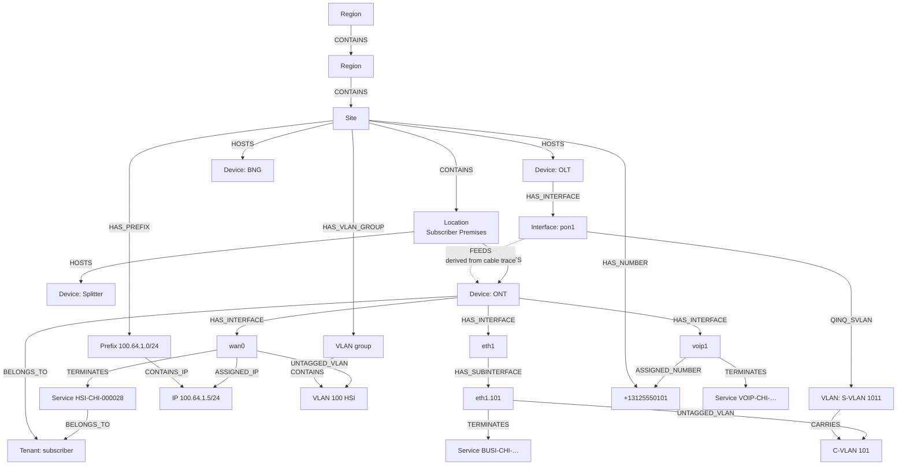
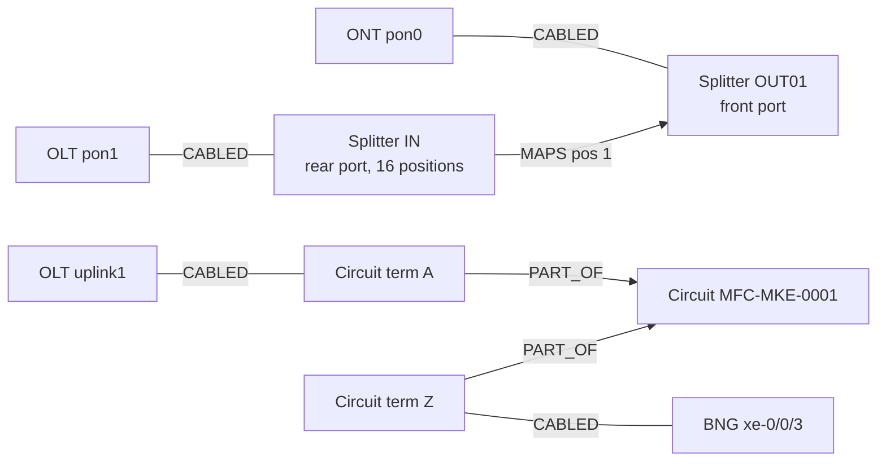

# Graph model (`nbgraph` schema)

nb_graph treats NetBox as a **labelled property graph**. Each vertex is a NetBox object. Each edge is a
relationship NetBox already stores, either as an FK, a generic FK, a cable termination or a computed cable path.
Everything is computed at query time from NetBox's tables, in the same PostgreSQL 19 database.



Physical lens, for the same ONT:



## Vertices

`nbgraph.vertices` columns: `id` (`kind:nb_id`), `kind`, `nb_id`, `label`, `subtype`, `status`, `layer`,
`kind_title`, `props` (jsonb), `api_path` (NetBox REST), `ui_path` (NetBox web).

| kind | NetBox table | label | subtype | status | notable props |
|---|---|---|---|---|---|
| `region` | dcim_region | name | `root` / `region` | active | slug, parent_id, ltree path |
| `site` | dcim_site | name | site | site status | facility, region_id, lat/long |
| `location` | dcim_location | name | location | status | site_id |
| `device` | dcim_device | name | **role slug** (`olt`, `ont`, `splitter`, `bng`, …) | status | model, serial, tenant, primary_ip4 |
| `interface` | dcim_interface | name | interface type (`gpon`, `1000base-t`, `virtual`, …) | **`provisioned`** if it or a sub-interface terminates a VC, else `active`/`disabled` | device, device_role, mode, **service_class** (`pon`/`wan`/`voip`/`ethernet`/`uplink`/`mgmt`) |
| `frontport` / `rearport` | dcim_frontport / dcim_rearport | name | port type | `free`/`connected` | device, positions |
| `circuit` | circuits_circuit | cid | type slug | status | provider, commit rate |
| `circuittermination` | circuits_circuittermination | `cid / A` | `term-a`/`term-z` | free/connected | site_id, speed |
| `provider` | circuits_provider | name | provider | – | |
| `prefix` | ipam_prefix | CIDR | role slug | status | role, size, **used** (count of IPs inside) |
| `ipaddress` | ipam_ipaddress | address | role or `address` | status | dns_name |
| `vlangroup` | ipam_vlangroup | name | vlangroup | – | vid_ranges, total, **used** |
| `vlan` | ipam_vlan | `vid name` | `svlan`/`cvlan`/`vlan` | status | vid, qinq_svlan_id |
| `number` | netbox_numbers_telephonenumber | E.164 | did | `available`/`assigned`/… | site, interface, sip_username |
| `virtualcircuit` | circuits_virtualcircuit | cid | type slug (`hsi`, `voip`, `business-ethernet`) | status | tenant, provider network |
| `tenant` | tenancy_tenant | name | tenant | – | group |

## Edges

`nbgraph.edges` columns: `id`, `src`, `dst`, `label`, `src_kind`, `src_id`, `dst_kind`, `dst_id`, `props`.

| label | from → to | derived from | lenses |
|---|---|---|---|
| `CONTAINS` | region→region, region→site, site→location, location→location, vlangroup→vlan | parent / region / site / group FKs | all |
| `HOSTS` | site→device (no location), location→device | device.site / device.location | service, physical, inventory |
| `HAS_INTERFACE` | device→interface (top-level) | interface.device | service, physical, inventory |
| `HAS_SUBINTERFACE` | interface→interface | interface.parent | service, physical, inventory |
| `HAS_PORT` | device→front/rear port | port.device | physical |
| `MAPS` | rearport→frontport | `dcim_portmapping` (props: positions) | physical |
| `CABLED` | A-termination → B-termination | `dcim_cable` + `dcim_cabletermination` (props: cable id/label/status/type) | physical |
| **`FEEDS`** | OLT PON interface → ONT device | **`dcim_cablepath`**: complete paths that start on an ONT interface and end on an interface | service, physical |
| `ASSIGNED_IP` | interface→ipaddress | generic FK `assigned_object` (dcim.interface) | service, inventory |
| `UNTAGGED_VLAN` / `TAGGED_VLAN` | interface→vlan | interface.untagged_vlan / M2M | service, inventory |
| `QINQ_SVLAN` | interface→vlan | interface.qinq_svlan | service, inventory |
| `CARRIES` | S-VLAN→C-VLAN | vlan.qinq_svlan | inventory |
| `ASSIGNED_NUMBER` | interface→number | telephonenumber.interface | service, inventory |
| `TERMINATES` | interface→virtualcircuit | `circuits_virtualcircuittermination` (props: role) | service |
| `HAS_PREFIX` | site→prefix | prefix scope (`_site_id`) | inventory |
| `HAS_VLAN_GROUP` | site→vlangroup | vlangroup scope = site | inventory |
| `HAS_NUMBER` | site→number | telephonenumber.site | inventory |
| `CONTAINS_IP` | prefix→ipaddress | `host(ip)::inet <<= prefix` (same VRF) | inventory |
| `PART_OF` | circuittermination→circuit | termination.circuit | physical |
| `PROVIDED_BY` | circuit→provider | circuit.provider | physical |
| `BELONGS_TO` | device/virtualcircuit→tenant | tenant FK | service |

The lens membership is data (`nbgraph.edge_label.lens`). Change it and the UI picks it up on the next call.

## SQL API

| Object | Signature | Use |
|---|---|---|
| `nbgraph.vertices` / `nbgraph.vertices_fn()` | view / SRF | all vertices |
| `nbgraph.edges` / `nbgraph.edges_fn()` | view / SRF | all edges |
| `nbgraph.neighbors(kind, id, dir='out', labels=NULL)` | SRF | one hop (`out`/`in`/`both`) |
| `nbgraph.traverse(kind, id, depth=2, labels=NULL, dir='out', limit=2500)` | SRF (depth, edge…) | BFS with visited set |
| `nbgraph.shortest_path(a_kind, a_id, b_kind, b_id, max_depth=12, labels=NULL)` | SRF (step, node, via_label, via_dir) | undirected BFS path |
| `nbgraph.out_degree(kind, ids[], labels=NULL)` | SRF | expandable-count badges |
| `nbgraph.stats` | view | counts per kind / label |
| `nbgraph.kind`, `nbgraph.edge_label` | tables | registries (titles, layers, NetBox paths, lenses) |

## Example queries

All of these were run against the seeded demo on PostgreSQL 19beta4.

```sql
-- OLTs as vertices
SELECT id, label, subtype, status FROM nbgraph.vertices WHERE kind = 'device' AND subtype = 'olt';
--     id     |   label    | subtype | status
--  device:2  | chi-olt-01 | olt     | active
--  device:13 | chi-olt-02 | olt     | active  ...

-- Which ONTs does chi-olt-01 pon1 feed?  (NetBox cable trace: ONT -> splitter OUT -> IN -> PON, 6 hops)
SELECT n.label AS ont, e.props->>'hops' AS hops
  FROM nbgraph.edges e JOIN nbgraph.vertices n ON n.kind = 'device' AND n.nb_id = e.dst_id
 WHERE e.label = 'FEEDS' AND e.src_kind = 'interface'
   AND e.src_id = (SELECT id FROM dcim_interface WHERE name = 'pon1'
                    AND device_id = (SELECT id FROM dcim_device WHERE name = 'chi-olt-01'));
-- chi-ont-0001 | 6,  chi-ont-0002 | 6,  chi-ont-0003 | 6,  chi-ont-0004 | 6

-- Everything provisioned on an ONT, 2 hops deep
SELECT depth, label, src_kind||':'||src_id AS src, dst_kind||':'||dst_id AS dst
  FROM nbgraph.traverse('device', (SELECT id FROM dcim_device WHERE name = 'chi-ont-0001'), 2,
                        ARRAY['HAS_INTERFACE','ASSIGNED_IP','ASSIGNED_NUMBER','TERMINATES'])
 WHERE depth = 2;
-- 2 | ASSIGNED_IP     | interface:26 | ipaddress:13
-- 2 | ASSIGNED_NUMBER | interface:26 | number:1
-- 2 | TERMINATES      | interface:28 | virtualcircuit:8 ...

-- Physical trace: Austin ONT -> splitter -> OLT -> metro circuit -> Chicago BNG
SELECT step, node, via_label, via_dir
  FROM nbgraph.shortest_path('device', (SELECT id FROM dcim_device WHERE name = 'aus-ont-0001'),
                             'device', (SELECT id FROM dcim_device WHERE name = 'chi-bng-01'),
                             12, ARRAY['HAS_INTERFACE','HAS_PORT','MAPS','CABLED','PART_OF']);
--  0 device:44 | 1 interface:293 HAS_INTERFACE | 2 frontport:129 CABLED | 3 rearport:9 MAPS
--  4 interface:279 CABLED | 5 device:42 | 6 interface:287 | 7 circuittermination:5 CABLED
--  8 circuit:3 PART_OF | 9 circuittermination:6 | 10 interface:6 CABLED | 11 device:1

-- IP pool utilisation for a site (number inventory)
SELECT v.label AS prefix, v.props->>'role' AS role, v.props->>'used' AS used, v.props->>'size' AS size
  FROM nbgraph.edges e JOIN nbgraph.vertices v ON v.kind = 'prefix' AND v.nb_id = e.dst_id
 WHERE e.label = 'HAS_PREFIX' AND e.src_kind = 'site'
   AND e.src_id = (SELECT id FROM dcim_site WHERE slug = 'chi-co-01');
--  10.1.0.0/24   | Management     | 2  | 256
--  100.64.1.0/24 | Subscriber WAN | 11 | 256
--  10.101.0.0/24 | VOIP           | 7  | 256
```

## Extending the model

1. Add a `UNION ALL` branch to `nbgraph.vertices_fn()` and/or `nbgraph.edges_fn()` (`db/graph/020_*.sql`, `030_*.sql`).
2. Register the new kind in `nbgraph.kind` (title, layer, REST and UI paths) and the label in `nbgraph.edge_label` (lenses).
3. `make graph-install`. Optionally give the kind a colour or glyph in `ui/src/graph/style.ts` and a form in
   `graph-api/app/crud.py` (`FORMS`, `CREATE_RULES`).
