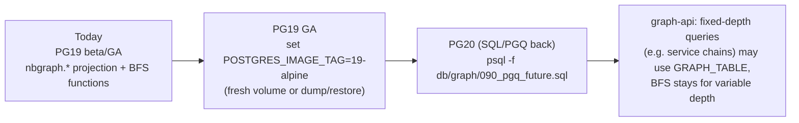

# PostgreSQL 19, SQL/PGQ and NetBox

## TL;DR

| Question | Answer (October 2026) |
|---|---|
| Is PostgreSQL 19 released? | **Not yet.** 19beta4 was released 2026-09-24. GA is planned for October 2026. nb_graph uses `postgres:19beta4-alpine`. |
| Does PG19 have native graph queries (SQL/PGQ, `CREATE PROPERTY GRAPH`, `GRAPH_TABLE … MATCH`)? | **No.** SQL/PGQ was committed for PG19 and then **reverted on 2026-09-07** ("design issues too late to address in this cycle"). It is expected in PG20 (≈ Sept 2027). |
| Does NetBox support PG19? | NetBox 4.7 requires **PG ≥ 15** with `ltree` and does not list PG19. **nb_graph runs it on PG19 anyway**, as you asked. |
| Does it actually work? | **Yes.** All 813 NetBox 4.7.2 migrations (+ the `netbox_numbers` plugin) applied cleanly on 19beta4. The UI, REST API, cable tracing, the nbgraph projection and the 16-test suite all pass. |
| Apache AGE (Cypher) on PG19? | Not available. AGE supports PG 14–18 and starts on a new major once it is stable. |

## How nb_graph makes PG19 "graph compliant" without SQL/PGQ

1. **Property-graph projection** (`db/graph/020_vertices.sql`, `030_edges.sql`). Vertex and edge tables with
   labels, keys and properties, the same model SQL/PGQ uses, computed live from NetBox's tables.
2. **Traversal operators** (`040_traversal.sql`): `neighbors`, `traverse` (BFS, variable depth, visited set)
   and `shortest_path`. Variable-length traversal is what the UI needs most, and even the PG19 beta
   implementation of SQL/PGQ did not support it (see Q4 below).
3. **A native PGQ definition kept ready** (`090_pgq_future.sql`). It is checked against the last beta that
   still had the feature, and the API can use it once a PGQ-capable PostgreSQL ships.

## NetBox on PG19: what was checked

| Check | Result on 19beta4 |
|---|---|
| `manage.py migrate` (813 migrations incl. `ltree` triggers, denormalisation triggers) | ✅ all applied |
| ICU `natural_sort` collation used by NetBox | ✅ (needs a PG build with ICU, which the official images have) |
| `ltree` extension | ✅ created in `db/initdb/00-extensions.sql` |
| Cable path tracing through splitter front/rear ports and circuits | ✅ |
| REST CRUD, `available-ips`, `available-vlans`, event rules → webhooks | ✅ |
| `netbox_numbers` plugin migrations, UI pages, REST | ✅ |

> Building PostgreSQL **without ICU** fails NetBox's migrations with `ICU is not supported in this build`. The
> official `postgres` images include ICU, so this only matters if you bring your own PostgreSQL.

## Verified on PG19beta3

`090_pgq_future.sql` was applied to a PostgreSQL **19beta3** server (built from the `REL_19_BETA3` tag, before the
revert) loaded with the nb_graph demo data:

```text
-- Q1: Site -> OLT -> PON -> ONT -> port -> service  (one fixed-length MATCH)
SELECT * FROM GRAPH_TABLE (nbgraph.network
  MATCH (s IS site)-[IS hosts]->(olt IS device)-[IS has_interface]->(pon IS interface)
        -[IS feeds]->(ont IS device)-[IS has_interface]->(port IS interface)-[IS terminates]->(svc IS virtualcircuit)
  WHERE s.slug = 'chi-co-01' AND olt.role = 'olt'
  COLUMNS (olt.name AS olt, pon.name AS pon, ont.name AS ont, port.name AS port, svc.cid AS service)
) ORDER BY ont, port LIMIT 8;

    olt     | pon  |     ont      |   port   |     service
------------+------+--------------+----------+-----------------
 chi-olt-01 | pon1 | chi-ont-0001 | eth3.101 | BUSI-CHI-000351
 chi-olt-01 | pon1 | chi-ont-0001 | voip1    | VOIP-CHI-000026
 chi-olt-01 | pon1 | chi-ont-0001 | wan0     | HSI-CHI-000028
 chi-olt-01 | pon1 | chi-ont-0002 | wan0     | HSI-CHI-000036
 chi-olt-01 | pon1 | chi-ont-0004 | voip1    | VOIP-CHI-000050
 chi-olt-01 | pon1 | chi-ont-0004 | wan0     | HSI-CHI-000052
 chi-olt-01 | pon2 | chi-ont-0005 | eth1.102 | BUSI-CHI-000338
 chi-olt-01 | pon2 | chi-ont-0005 | wan0     | HSI-CHI-000060

-- Q2: ONT -> port -> phone number
SELECT * FROM GRAPH_TABLE (nbgraph.network
  MATCH (ont IS device)-[IS has_interface]->(i IS interface)-[IS assigned_number]->(n IS number)
  WHERE ont.role = 'ont' COLUMNS (ont.name AS ont, i.name AS port, n.number AS did)) ORDER BY ont LIMIT 5;

     ont      | port  |     did
--------------+-------+--------------
 aus-ont-0001 | voip1 | +15125550100
 aus-ont-0004 | voip1 | +15125550101
 chi-ont-0001 | voip1 | +13125550101 ...

-- Q3: region tree (fixed depth)
 North America | US Midwest | Illinois  | Chicago Central Office  ...

-- Q4: variable-length path
MATCH (r IS region)-[IS contains]->{1,3}(s IS site)
ERROR:  element pattern quantifier is not supported
```

Things the PGQ beta was strict about, and how the definition handles them:

| Error raised by PG19beta3 | Cause | Fix in `090_pgq_future.sql` |
|---|---|---|
| `property "name" collation mismatch: default vs. natural_sort` | NetBox puts an ICU `natural_sort` collation on some `name` columns | `name::text COLLATE "default" AS name` |
| `property "name" data type mismatch: varchar(100) vs. varchar(64)` | Same property name, different `varchar` lengths across tables | cast shared properties (`name`, `status`, `slug`, `role`) to `text` |
| `multiple path patterns in one GRAPH_TABLE clause not supported` | `MATCH (a)-…, (a)-…` | use one linear path per `GRAPH_TABLE` |
| `element pattern quantifier is not supported` | `-[…]->{1,3}` | variable depth stays in `nbgraph.traverse()` |

Generic FKs (IP assignment) and the derived `FEEDS` relationship are exposed to PGQ through small helper views
(`nbgraph.pgq_assigned_ip`, `nbgraph.pgq_feeds`, `nbgraph.pgq_device`).

## Migration path



## Sources

* PostgreSQL roadmap: 19beta4 on 2026-09-24, GA planned for October 2026. https://www.postgresql.org/developer/roadmap/
* Command Prompt, *Two features just left PostgreSQL v19* (SQL/PGQ reverted 2026-09-07). https://www.commandprompt.com/blog/two-features-just-left-postgresql-19/
* Neon, *PostgreSQL 19 SQL/PGQ*: syntax and fixed-length-only limitation. https://neon.com/postgresql/postgresql-19/sql-pgq-graph-queries
* NetBox 4.7 release notes: PostgreSQL 15+ and ltree required. https://netboxlabs.com/docs/netbox/release-notes/version-4.7
* Apache AGE roadmap discussion (PG 14–18). https://github.com/apache/age/discussions/2305
