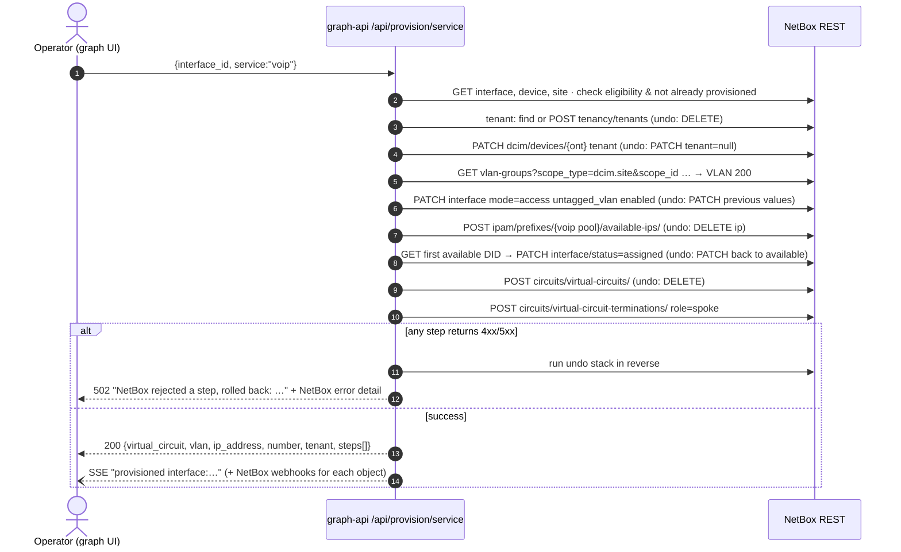

# FTTH demo model and service provisioning

## Demo network (seeded by `graph-api/app/seed.py`)

| Layer | Objects |
|---|---|
| Regions | North America › US Midwest › {Illinois, Wisconsin}; North America › US South › Texas |
| Sites (central offices) | `chi-co-01` Chicago (hub, 2 OLTs + BNG), `npv-co-01` Naperville, `mke-co-01` Milwaukee, `aus-co-01` Austin |
| Location | *Subscriber Premises* per site (splitters + ONTs) |
| Device types (fictional vendor "Acme Optical") | `AO-OLT-8` (pon1-8 GPON, uplink1-2 SFP+, mgmt0) · `AO-SPL-1x16` (rear `IN` ×16 positions → front `OUT01-16`) · `AO-ONT-4V` (pon0, eth1-4, voip1-2, wan0) · `Generic BNG` (xe-0/0/0-7) |
| Cabling | OLT `ponN` → splitter `IN`; splitter `OUTxx` → ONT `pon0`; hub OLT uplink → BNG; remote OLT uplink → circuit `MFC-<SITE>-0001` (A) … (Z) → BNG |
| IPAM | per site: `10.<n>.0.0/24` Management, `100.64.<n>.0/24` Subscriber WAN, `10.10<n>.0.0/24` VOIP |
| VLANs | per site: S-VLAN group 1000-1999 (one S-VLAN per used PON, on the PON port in Q-in-Q mode); C-VLAN group 100-999 (100 = HSI, 200 = VOIP, the rest is allocated to Business Ethernet) |
| Numbers | 24 DIDs per site (`+1<area>555 01xx`) in the `netbox_numbers` plugin |
| Services | ~40 virtual circuits (HSI / VOIP / Business Ethernet) on the provider network *Residential Access Fabric* |
| Live updates | Webhook *nb_graph live events* + event rule on create/update/delete for 13 object types |

The seeder uses the **same provisioning code** as the UI, so the demo data is also a test of the provisioning engine.

## Service catalogue

| Service | Port | What gets created / changed in NetBox |
|---|---|---|
| **HSI** (High-Speed Internet) | `wan*` (virtual) | interface → access mode, untagged **C-VLAN 100** · next free **IP** in the site's *Subscriber WAN* prefix · virtual circuit `HSI-<SITE>-<id>` (type `hsi`) + spoke termination |
| **VOIP** | `voip*` (virtual) | access **C-VLAN 200** · next free **IP** in the *VOIP* prefix · next **available DID** at the site → `assigned` with SIP username · VC `VOIP-<SITE>-<id>` |
| **Business Ethernet** | `eth*` (physical) | **new sub-interface** `ethN.<vid>` · **new C-VLAN** from the site's C-VLAN group via `available-vlans`, Q-in-Q'd (`qinq_role=cvlan`, `qinq_svlan`) under the S-VLAN of the PON that feeds this ONT (found from NetBox's cable trace) · VC `BUSI-<SITE>-<id>` on the sub-interface |

All services also resolve or create the **subscriber tenant** (auto: `Subscriber <ONT>`, or an existing or new tenant
you pick) and set it on the ONT, IPs, VLAN, DID and VC.

## The provisioning saga

**Deprovision** (`DELETE /api/provision/service/{interface_id}?vc_id=`) deletes the VC (which removes its
termination), deletes the service IPs, releases DIDs back to `available`, and either deletes the Business
Ethernet sub-interface and its C-VLAN or resets the access VLAN on the port.

## Adding an ONT from the graph

`POST /api/provision/ont {pon_interface_id, serial?, name?}` (UI: click a PON port → *Add* → **Add ONT**):

1. follows the PON port's cable to the splitter `IN` rear port
2. picks the first free splitter `OUTxx` front port (409 if the splitter is full)
3. creates the ONT (`AO-ONT-4V`, role ONT) in the site's *Subscriber Premises* location. NetBox instantiates
   pon0/eth1-4/voip1-2/wan0 from the device-type templates.
4. cables `OUTxx` ↔ ONT `pon0`. NetBox recomputes the cable path, so the `FEEDS` edge from the PON port appears
   straight away.

## Rules enforced

| Rule | Where |
|---|---|
| Services only on ONT ports; wan→HSI, voip→VOIP, physical eth→Business Ethernet | `eligible_services()` (400) |
| One HSI/VOIP service per port (Business Ethernet allows several sub-interfaces) | 409 |
| A number linked to an interface cannot be `available` | `TelephoneNumber.clean()` (plugin) |
| IP uniqueness, VLAN group ranges, Q-in-Q consistency, VC termination only on virtual interfaces | NetBox itself |
