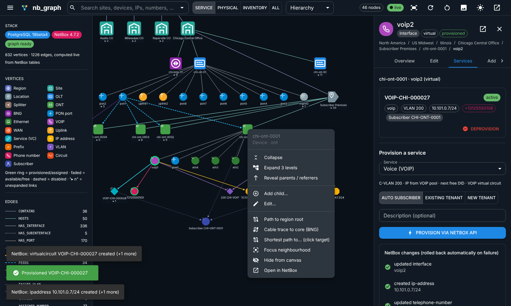
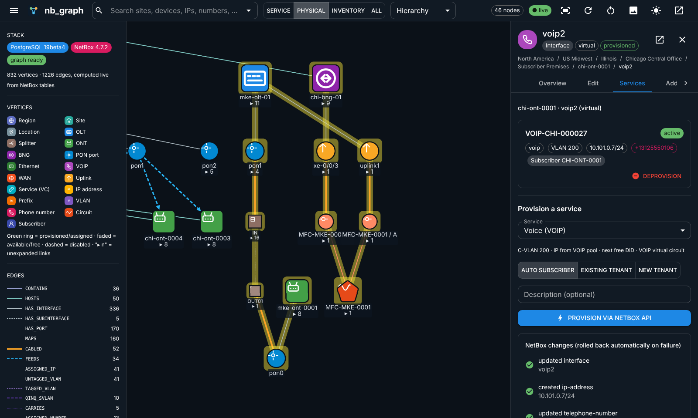
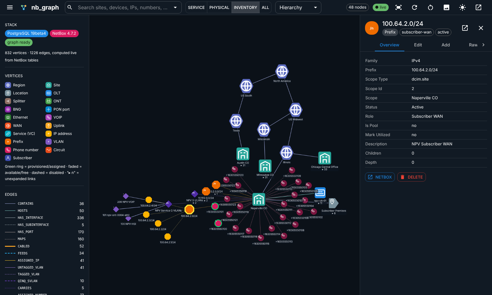
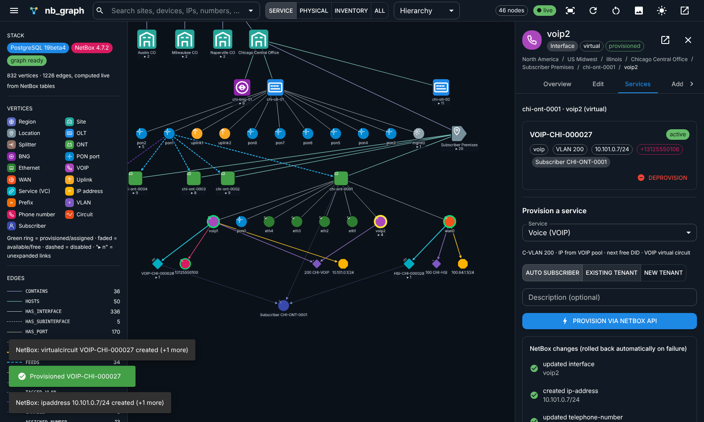

# UI guide

## Layout

| Area | What it holds |
|---|---|
| **Top bar** | global search (any vertex: sites, devices, interfaces, IPs, VLANs, DIDs, circuits, tenants), **lens** switch, **layout** picker, node count, live indicator, fit / re-layout / reset / PNG export / theme / open NetBox |
| **Left panel** | stack status (PostgreSQL & NetBox versions, graph schema), vertex legend, edge legend with live counts, gesture help |
| **Canvas** | Cytoscape graph. Colour and glyph = kind/role/service class. Ring = status. `▸ n` = links not yet shown under the current lens. |
| **Inspector (right)** | opens when you click a node: header, **breadcrumb path to the region root**, tabs **Overview · Edit · Services · Add · Raw** |

## Gestures

| Gesture | Action |
|---|---|
| **Double-click** node | expand its outgoing links (current lens), or collapse it again. Collapsing removes only what this node revealed. |
| **Click** node | select it and open the inspector |
| **Right-click** node | context menu: Expand · Expand 3 levels · Reveal parents/referrers · Provision service… · Add child… · Edit… · Path to region root · Cable trace to core (BNG) · Shortest path to… (then click the target) · Focus neighbourhood · Hide · Open in NetBox |
| Hover edge | shows its label (`FEEDS`, `CABLED`, …) |
| Drag / wheel / box-select | move nodes, zoom, multi-select |
| Click empty canvas | clear the selection and highlights |

## Lenses

| Lens | Edge labels | Use it for |
|---|---|---|
| **Service** (default) | containment, HOSTS, HAS_INTERFACE, FEEDS, ASSIGNED_*, VLANs, TERMINATES, BELONGS_TO | Region → Site → OLT → PON → ONT → port → service |
| **Physical** | containment, ports, MAPS, **CABLED**, FEEDS, circuits | splitters, patching, backhaul circuits |
| **Inventory** | containment, prefixes, CONTAINS_IP, VLAN groups, CARRIES, DIDs | number inventory: IP pools, VLAN IDs, phone numbers |
| **All** | everything | debugging |

## CRUD from the graph

* **Edit:** Inspector → *Edit*. The form is built from NetBox's field metadata: choices, required flags,
  searchable FK pickers. *Save to NetBox* sends a PATCH with only the fields you changed. NetBox validation errors
  appear field by field.
* **Create child:** Inspector → *Add* (or right-click → *Add child…*). The options depend on context:

  | Selected | Can create |
  |---|---|
  | Region | sub-region, site |
  | Site | device (OLT/BNG…), location, prefix, VLAN group, telephone number |
  | Location | device |
  | Device | interface |
  | Interface | IP address, sub-interface |
  | OLT PON port | **ONT** (auto-cabled to the next free splitter port) |
  | VLAN group | VLAN |

  The parent is filled in for you (e.g. `region = <selected>`). After saving, the parent re-expands to show the
  new child.
* **Delete:** Inspector → *Overview* → *Delete*, then confirm. NetBox applies its own cascade/protect rules.
* **Open in NetBox:** every node links to its NetBox page.

## Provisioning

Click an ONT port (`wan0`, `voip1/2`, `eth1-4`). The inspector opens on **Services**:

1. Existing services on the port are listed as cards (VC id, VLAN, IPs, DIDs, tenant) with **Deprovision**.
2. Pick the service (only the ones that fit the port are offered), the subscriber (auto / existing / new
   tenant) and an optional description.
3. **Provision via NetBox API** runs the saga and lists every NetBox change it made. The port gets a green ring
   and its new children (IP, VLAN, DID, service) appear on the canvas.

## Map view

The globe button next to the logo switches to a map of sites, placed by their NetBox **latitude/longitude**
(OpenStreetMap tiles, so the browser needs internet access).

* Marker size and number = devices at the site. Grey = site not `active`.
* Orange lines = circuits whose A and Z ends terminate on two different sites (the metro backhaul in the demo).
  Hover for CID, provider and status. Dashed = circuit not `active`.
* Click a marker for its roll-up (devices per role, active services). **Show in graph →** switches back to the
  graph view with that site expanded.
* **Drag to reposition**: turn it on, then drag a marker. The new position is saved to NetBox (`PATCH` through
  the CRUD API).
* Sites with no coordinates are listed in the panel. Click **Place**, then click the map.
* Site, device and circuit changes from anywhere (including NetBox's UI) refresh the map live.

## Bulk provisioning

Right-click a region, site, OLT, OLT PON port or ONT → **Bulk provision…**. Pick a service to see the dry run
(ONTs in scope, eligible ports, how many already have the service), then **Provision N ports**. A progress bar
and per-port results (CID or error) update live. See [provisioning.md](provisioning.md#bulk-provisioning).

## Live updates

The `● live` chip shows the SSE connection. Any change, whether it comes from this UI, another browser, or
NetBox's own UI or API (through the webhook), refreshes the visible nodes and flashes the ones that changed. For
external edits a toast shows who changed what.

## Tips

* The search shows the kind, parent device and subtype. Picking a result that isn't on the canvas loads its path
  from the region root.
* Use **Reset** to return to the region tree. **Expand 3 levels** on a site gives a full site picture in one step.
* **Organic** layout suits inventory views, **Hierarchy** suits the service chain.
* `window.nbgraph` in the browser console is the graph controller (handy for demos and e2e tests).
